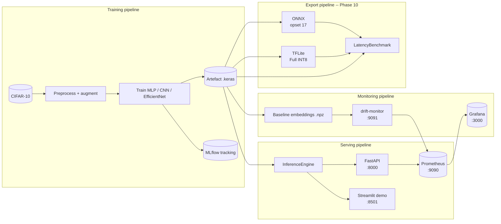

# Architecture

This page gives a single-screen tour of the project's runtime
architecture. For task-specific walkthroughs head to the
[tutorials](tutorials/index.md).

## System diagram



## Source-tree map

```
src/deepvision/
├── __main__.py          # Typer CLI (train, serve, streamlit, drift-monitor, export)
├── config.py            # Pydantic Settings -- centralised configuration
├── constants.py         # CIFAR-10 class names, image sizes, default seed
├── utils/
│   ├── logging.py       # get_logger helper used by every module
│   └── seed.py          # set_global_seed(Python+NumPy+TensorFlow)
├── data/
│   ├── loader.py        # Stratified CIFAR-10 split with dataset_hash
│   ├── preprocessing.py # normalise / resize / NHWC conversion
│   └── augmentation.py  # tf.image-based augmentation layers
├── models/
│   ├── mlp.py / cnn.py / efficientnet.py
│   └── registry.py      # build_model("mlp" | "cnn" | "efficientnet")
├── training/
│   ├── train.py         # run_training(TrainConfig) -> TrainResult
│   ├── callbacks.py     # MLflow-aware Keras callbacks
│   └── mlflow_utils.py  # setup, log params / metrics / artefacts
├── evaluation/
│   ├── metrics.py       # accuracy, macro/weighted F1, ECE
│   ├── calibration.py   # temperature scaling
│   ├── interpretability.py  # Grad-CAM
│   ├── robustness.py    # FGSM, gaussian noise
│   └── benchmark.py     # generic LatencyResult (Phase 4)
├── serving/
│   ├── api.py           # FastAPI app + middleware
│   ├── inference.py     # Lazy-loading InferenceEngine
│   ├── preprocess.py    # magic-bytes file validation, resize
│   ├── schemas.py       # Pydantic v2 request/response models
│   └── prometheus.py    # request counter / latency histogram
├── streamlit_app.py     # Single-file Streamlit demo (Phase 6 refonte)
├── monitoring/
│   ├── drift.py         # Wasserstein-1D distance per embedding dim
│   ├── ood.py           # Energy-based OOD scoring (Liu et al. 2020)
│   ├── baseline.py      # Baseline dataclass + .npz I/O
│   └── server.py        # DriftMonitor exporter (:9091)
└── export/              # Phase 10
    ├── onnx.py          # Keras -> ONNX via tf2onnx + validation
    ├── tflite.py        # Keras -> TFLite (4 quantization modes)
    └── benchmark.py     # Multi-runtime LatencyBenchmark
```

Heavy imports (TensorFlow, ONNX, Streamlit, ...) are **deferred** inside
each command so `deepvision --help` and `deepvision info` return in
under 200 ms.

## Runtime topology (Docker stack)

The `docker-compose.yml` boots six services on a private
`deepvision` network:

| Service | Image | Port | Healthcheck |
|---|---|---|---|
| `api` | `deepvision-api` | 8000 | `GET /health` |
| `streamlit` | `deepvision-streamlit` | 8501 | `streamlit/_stcore/health` |
| `mlflow` | `ghcr.io/mlflow/mlflow` | 5000 | `GET /` |
| `prometheus` | `prom/prometheus` | 9090 | `GET /-/healthy` |
| `grafana` | `grafana/grafana` | 3000 | `GET /api/health` |
| `drift-monitor` | `deepvision-api` (different entrypoint) | 9091 | `GET /metrics` |

The three `deepvision-*` images share a multi-stage base layer
(`docker/python.Dockerfile`) so the unique payloads stay around
~500 MB on top of the ~1.5 GB TensorFlow + Pillow base. CI builds
them with `buildx` and caches the layer graph in `type=gha` between
runs.

## Data flow

### Train -> model artefact

1. `deepvision.data.loader.load_cifar10()` returns a frozen
   [`CifarSplit`][deepvision.data.loader.CifarSplit] with a SHA-256
   `dataset_hash` logged to MLflow for traceability.
2. `deepvision.training.train.run_training(TrainConfig)` builds the
   chosen model, runs Keras `fit`, evaluates on the test split,
   serialises the best weights to `.keras` format, and logs everything
   (params, metrics, the model itself, a confusion matrix and a
   classification report) to MLflow.
3. The CLI command `deepvision train ...` is a thin wrapper around
   `run_training` plus a final pretty-print summary.

### Model artefact -> live inference

1. `deepvision.serving.inference.InferenceEngine` is **lazy** -- the
   model is loaded only on the first call to `predict()`, so the
   FastAPI process boots in ~2 s and passes its readiness probe
   immediately.
2. Uploaded files are validated by **magic bytes** (not file extension)
   in [`deepvision.serving.preprocess.validate_payload_size`][deepvision.serving.preprocess.validate_payload_size],
   capped at `DEEPVISION_MAX_IMAGE_BYTES` (default 10 MB).
3. Every successful prediction increments a Prometheus counter and
   records a latency histogram with `(class_name, model_version)`
   labels.

### Live inference -> drift signal

1. At training time, [`deepvision.monitoring.baseline.extract_embeddings`][deepvision.monitoring.baseline.extract_embeddings]
   captures the penultimate-layer activations on the training set and
   stores them in `models/baseline.npz`.
2. The `drift-monitor` service polls the live embeddings on a
   configurable interval (`--interval 60` by default), computes the
   1D Wasserstein distance per embedding dimension against the
   baseline, and exposes the aggregated `mean` / `p95` / `max` as
   Prometheus gauges.
3. Eight alerting rules in `monitoring/alerts.yml` fire when the drift
   score crosses thresholds; the Grafana dashboard renders them on a
   single status row.

## Quality gates (CI)

Every push to `main` triggers four workflows in parallel:

- `ci.yml` -- `ruff check`, `ruff format --check`, `mypy src`,
  `pytest -q` on Python 3.11 + 3.12 (matrix), with coverage uploaded
  to Codecov.
- `security.yml` -- `bandit`, `pip-audit`, `gitleaks`, `codeql`, and
  `trivy` (on tag releases only -- image build is expensive).
- `docker.yml` -- multi-stage build + push to GHCR on `main` and tags.
- `docs.yml` -- builds this site and deploys to `gh-pages` on `main`.

A force-push cancels in-progress runs via `cancel-in-progress`
concurrency so CI minutes do not pile up.
